# Ejercicios Prácticos - React + TypeScript

## 1. Contador

Aplicación de contador simple construida con React, TypeScript y Bootstrap.

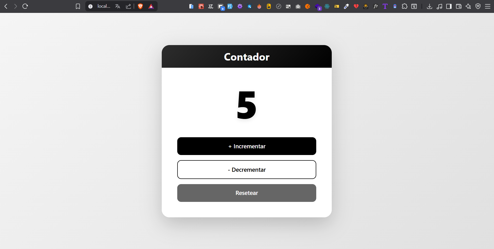

## 2. Formulario de Login

Formulario de login controlado con validaciones en TypeScript.

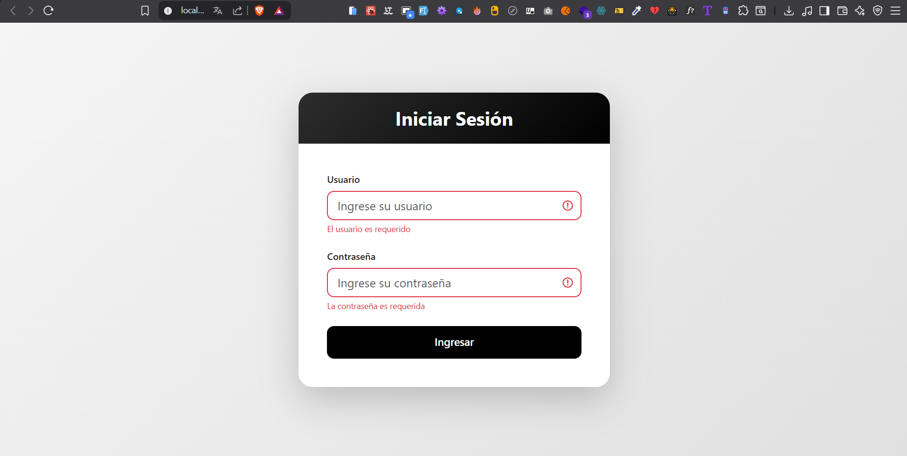

- Validación de usuario (mínimo 3 caracteres)
- Validación de contraseña (mínimo 6 caracteres)
- Diseño en blanco y negro
- Feedback visual de errores

## 3. To-Do List

Lista de tareas con estado global usando Context API y TypeScript.

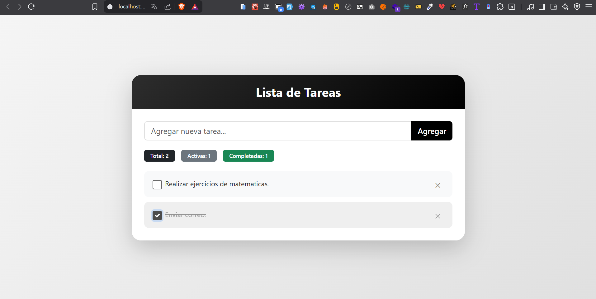

- Context API para estado global
- Agregar, completar y eliminar tareas
- Contador de tareas activas y completadas
- Persistencia en memoria durante la sesión

## 4. Custom Hook - Temporizador Regresivo

Temporizador regresivo con custom hook en TypeScript.

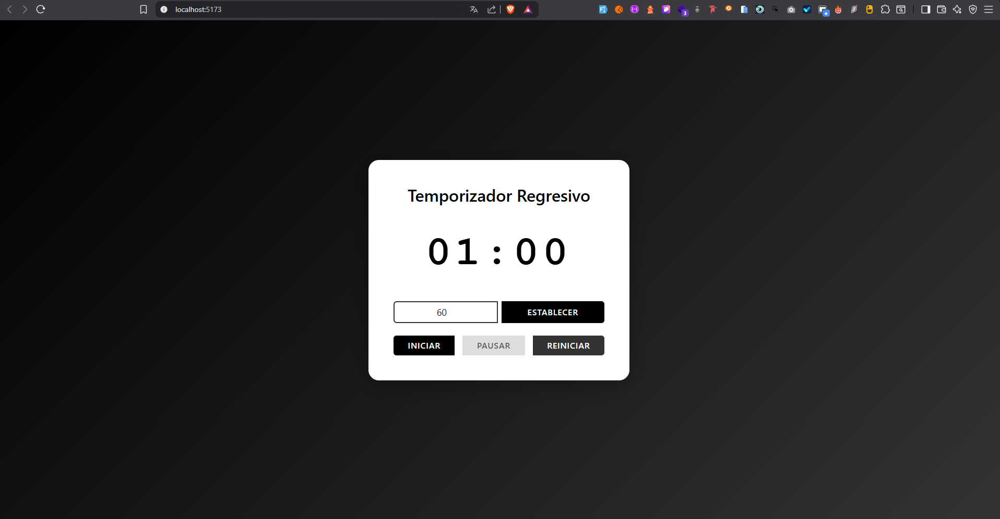

- Custom hook `useCountdown` para manejar el temporizador
- Control de tiempo: iniciar, pausar y reiniciar
- Input para establecer tiempo personalizado
- Formato de tiempo MM:SS

## 5. Tabla de Usuarios

Tabla de usuarios con datos obtenidos desde una API REST creada con Node.js y Express.

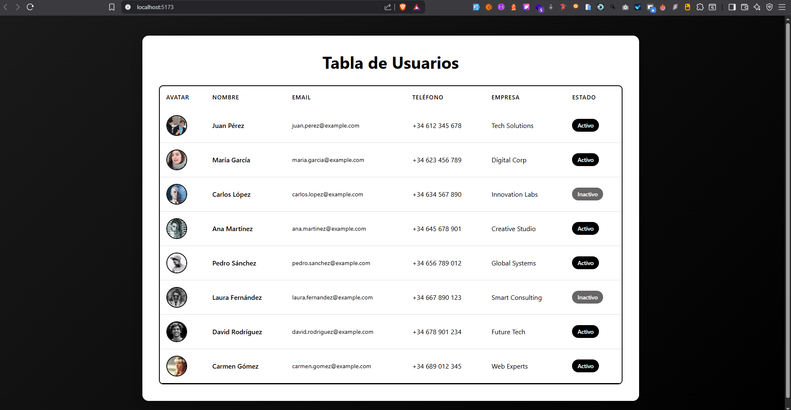

- Frontend: React + TypeScript + Bootstrap
- Backend: Node.js + Express
- Fetch de datos desde API REST
- Estados de carga y manejo de errores
- Avatares de usuarios
- Badges de estado activo/inactivo

## 6. Endpoint - Catálogo de Productos

Catálogo de productos consumiendo datos de una API REST con Axios.

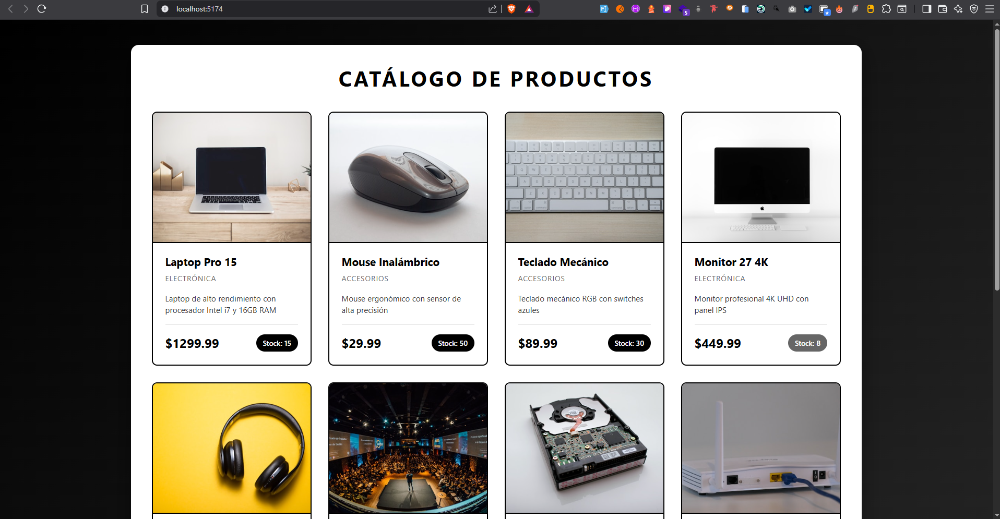

- Frontend: React + TypeScript + Axios + Bootstrap
- Backend: Node.js + Express
- Consumo de API con Axios
- Grid responsivo de productos
- Tarjetas con imágenes, precios y stock
- Manejo de estados de carga y errores

## 7. Formulario Dinámico de Estudiantes

Formulario dinámico para registro de múltiples estudiantes con validaciones.

- Formulario dinámico con TypeScript
- Validaciones completas de campos
- Agregar múltiples estudiantes a una lista
- Eliminar estudiantes individualmente
- Grid responsivo (formulario y lista)
- Contador de estudiantes registrados

## 8. Componentes con Props Tipadas

Componentes reutilizables con props tipadas en TypeScript.

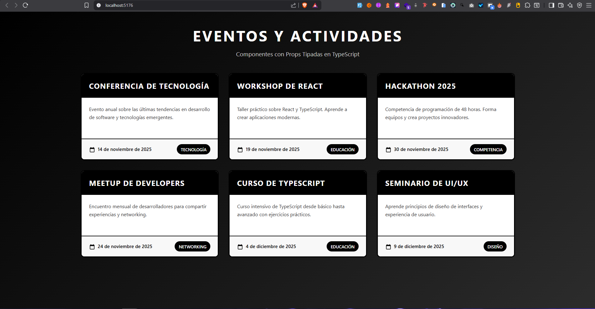

- Componente Card reutilizable
- Interface TypeScript para props
- Props requeridas y opcionales
- Formato de fechas localizado
- Grid responsivo de cards
- Efectos hover en tarjetas

## 9. Filtro de Búsqueda de Libros

Aplicación con filtro de búsqueda en tiempo real sobre una lista obtenida desde una API de Node.js.

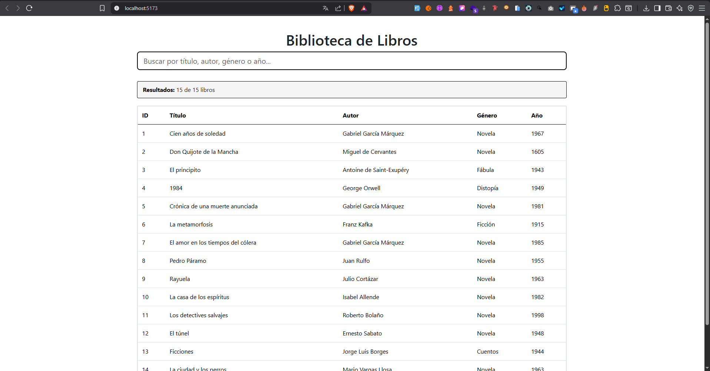

- Frontend: React + TypeScript + Bootstrap
- Backend: Node.js + Express
- Búsqueda en tiempo real por título, autor, género o año
- Filtrado instantáneo sin botones
- Contador de resultados filtrados vs totales
- Tabla responsiva con datos de libros
- Estados de carga y error
- Mensaje cuando no hay coincidencias

## 10. Formulario No Controlado con useRef

Formulario no controlado en React usando `useRef` con tipado TypeScript.

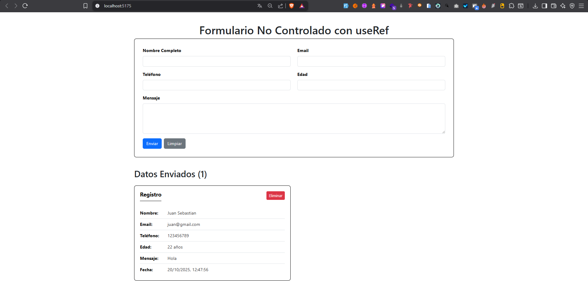

- Formulario no controlado con useRef
- Referencias tipadas para cada input
- Campos: nombre, email, teléfono, edad, mensaje
- Acceso directo al DOM sin estado controlado
- Botones enviar y limpiar
- Almacenamiento de datos enviados con timestamp
- Visualización de registros en tarjetas
- Eliminación individual de registros
- Contador de registros guardados

## 11. Sistema de Autenticación con JWT

Sistema de autenticación completo con JSON Web Tokens (JWT). Backend en Node.js y frontend en React.

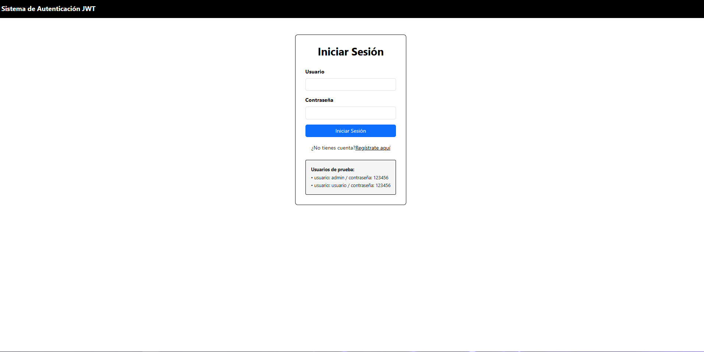

- Frontend: React + TypeScript + Axios + Bootstrap
- Backend: Node.js + Express + JWT + bcryptjs
- Registro de usuarios con validación
- Login con autenticación segura
- Contraseñas encriptadas con bcrypt
- Generación y validación de tokens JWT
- Rutas protegidas con middleware
- Dashboard con perfil de usuario autenticado
- Acceso a datos protegidos con token
- Persistencia de sesión con localStorage
- Manejo de errores y estados de carga
- Tokens con expiración (1 hora)

## 12. Custom Hook useApi

Hook personalizado en TypeScript para manejar llamadas a APIs con estados de loading, error y data.

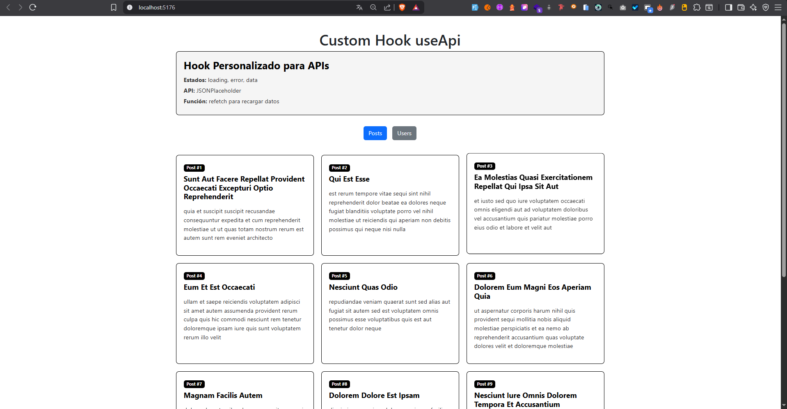

- Custom hook genérico `useApi<T>` con TypeScript
- Estados de loading, error y data tipados
- Función refetch para recargar datos
- Consumo de JSONPlaceholder API (posts y users)
- Alternancia entre diferentes endpoints
- Componentes reutilizables: LoadingSpinner, ErrorMessage, PostCard, UserRow
- Manejo completo de ciclo de vida de peticiones
- Grid responsivo para posts
- Tabla para usuarios
- Diseño minimalista en blanco y negro

## 13. Lista Genérica TypeScript

Componente de lista genérica tipado que puede recibir y renderizar arrays de objetos de cualquier tipo.

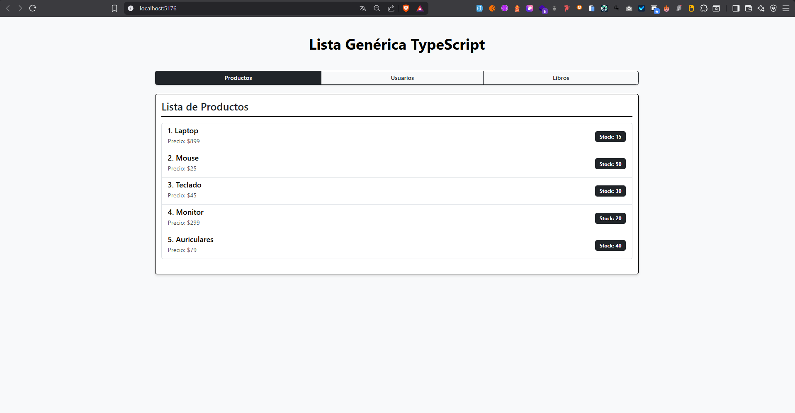

- Componente genérico `GenericList<T>` con TypeScript
- Props tipadas: data, renderItem y title
- Función render personalizable para cada tipo de dato
- Tres ejemplos implementados: Productos, Usuarios y Libros
- Interfaces TypeScript para cada tipo (Product, User, Book)
- Alternancia entre listas con botones
- Badges informativos (stock, edad, año de publicación)
- Mensaje cuando no hay datos disponibles
- Renderizado flexible según el tipo de dato
- Diseño responsivo con Bootstrap

